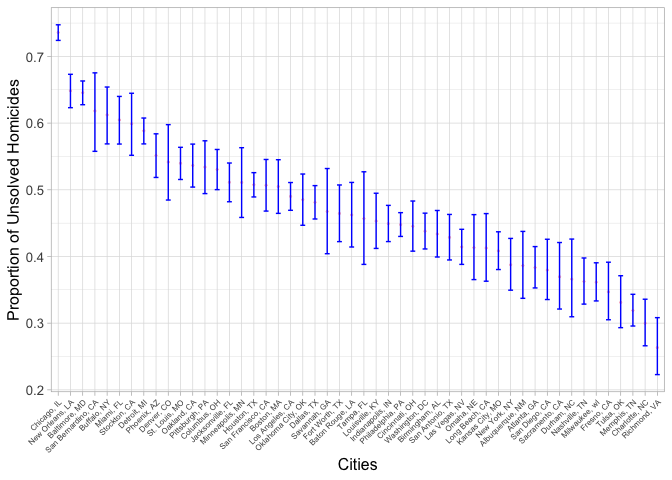

p8105_hw5_ly2633
================
Leila Yan
2024-11-04

``` r
# Load libraries
library(tidyverse)
```

    ## ── Attaching core tidyverse packages ──────────────────────── tidyverse 2.0.0 ──
    ## ✔ dplyr     1.1.4     ✔ readr     2.1.5
    ## ✔ forcats   1.0.0     ✔ stringr   1.5.1
    ## ✔ ggplot2   3.5.1     ✔ tibble    3.2.1
    ## ✔ lubridate 1.9.3     ✔ tidyr     1.3.1
    ## ✔ purrr     1.0.2     
    ## ── Conflicts ────────────────────────────────────────── tidyverse_conflicts() ──
    ## ✖ dplyr::filter() masks stats::filter()
    ## ✖ dplyr::lag()    masks stats::lag()
    ## ℹ Use the conflicted package (<http://conflicted.r-lib.org/>) to force all conflicts to become errors

``` r
library(ggplot2)
```

# Problem 1

# Problem 2

Question: Conduct a simulation to explore power in a one-sample t-test.
For each dataset, save 𝜇̂ and the p-value arising from a test of
𝐻:𝜇=0using 𝛼=0.05 Hint: to obtain the estimate and p-value, use
broom::tidy to clean the output of t.test.

``` r
# Conduct a simulation to explore power in one-sample t-test
onesample_t_test = function(mu){
  n=30
  sigma = 5
  x=rnorm(n,mean=mu,sd=sigma)
  
  t_test_output = t.test(x,mu=0, conf.level = 0.95)|>
              broom::tidy()
  
  return(t_test_output)
}

onesample_t_test_sim = 
  expand_grid(
    mu = c(0:6),
    iter = 1:5000
  ) %>%
  mutate(
    ttest_output = map(mu, onesample_t_test)
  ) %>%
  unnest(ttest_output)
```

Question: Make a plot showing the proportion of times the null was
rejected (the power of the test) on the y axis and the true value of 𝜇on
the x axis. Describe the association between effect size and power.

``` r
onesample_t_test_sim %>%
  mutate(
    reject = ifelse(p.value < 0.05, 1, 0)
  )%>%
  group_by(mu,reject) %>%
  filter(reject == 1)%>%
  summarise(reject_count =n())%>%
  mutate(power = reject_count/5000)%>%
  ggplot(aes(x=mu, y=power))+
  geom_point(size=0.4)+
  geom_line(size=0.35)+
  scale_x_continuous(breaks=0:6)+
  scale_y_continuous(breaks=seq(0,1, by=0.05))+
  labs(title="Plot of Power against True population mean", x="True mu", y="Power")+
  theme(plot.title=element_text(hjust=0.5))
```

    ## `summarise()` has grouped output by 'mu'. You can override using the `.groups`
    ## argument.

    ## Warning: Using `size` aesthetic for lines was deprecated in ggplot2 3.4.0.
    ## ℹ Please use `linewidth` instead.
    ## This warning is displayed once every 8 hours.
    ## Call `lifecycle::last_lifecycle_warnings()` to see where this warning was
    ## generated.

<!-- -->

Answers: We see a clear positive association between effect size and
power. When the true value of μ is small, the power is low, meaning the
test has a lower chance of detecting an effect and rejecting the null
hypothesis. As μ increases, power rises as well, approaching 1 for
higher values of μ. This trend indicates that with larger effect sizes,
it becomes easier for the test to identify a difference from the null,
leading to a higher probability of rejection. This behavior is expected
in hypothesis testing; small effects are more challenging to detect due
to their similarity to random noise, resulting in lower power.
Conversely, as the effect size grows, the distinction from the null
becomes more pronounced, allowing the test to detect the effect with
greater accuracy, thus increasing power.

Question: Make a plot showing the average estimate of 𝜇̂ on the y axis
and the true value of 𝜇on the x axis. Make a second plot (or overlay on
the first) the average estimate of 𝜇̂ only in samples for which the null
was rejected on the y axis and the true value of 𝜇on the x axis. Is the
sample average of 𝜇̂ across tests for which the null is rejected
approximately equal to the true value of 𝜇? Why or why not?

``` r
onesample_t_test_summary = onesample_t_test_sim %>%
  mutate(
    reject = ifelse(p.value < 0.05, 1, 0)
  ) %>%
  group_by(mu) %>%
  summarise(
    avg_mu_hat_all = mean(estimate),
    avg_mu_hat_rejected = mean(estimate[reject == 1]),
    .groups = 'drop'
  )


ggplot(onesample_t_test_summary, aes(x = mu)) +
  geom_line(aes(y = avg_mu_hat_all, color = "All Samples")) +
  geom_point(aes(y = avg_mu_hat_all, color = "All Samples")) +
  geom_line(aes(y = avg_mu_hat_rejected, color = "Rejected Samples")) +
  geom_point(aes(y = avg_mu_hat_rejected, color = "Rejected Samples")) +
  labs(
    x = "True Mean (μ)",
    y = "Average Estimate of μ̂",
    title = "Average Estimate of μ̂ by True Value of μ",
    color = "Sample Group"
  ) +
  theme_minimal()
```

<!-- -->

Answer: The average estimate closely follows the true𝜇, indicating an
unbiased estimate. However, for samples where the null was rejected, the
average estimate of 𝜇̂is consistently higher than the true𝜇 ,
particularly at lower values. Thus, the sample average across tests for
which the null is rejected is not approximately equal to the true value
of 𝜇. This is because when focusing only on tests that reject the null
hypothesis, we introduce a selection bias that overrepresents larger
observed effects, leading to an upward bias in the estimate of 𝜇.

# Problem 3

Describe the raw data.

``` r
# load the data
homicide_data = 
  read.csv("homicide-data.csv") %>%
  janitor::clean_names()
```

A description of the raw data: The raw dataset contains 12 variables and
52179 observations. It includes information on homicide cases across the
states. Each row corresponds to a unique case identified by a UID. The
columns include the report date, victim’s last and first names, race,
age, and sex, along with the city and state. Additional fields provide
geographic coordinates (latitude and longitude) of the incident location
and the case’s disposition status (e.g., “Closed by arrest,” “Closed
without arrest,” “Open/No arrest”). Some victim ages are recorded as
“Unknown,” and a few entries lack latitude and longitude data.

``` r
# Create a city_state variable (e.g. “Baltimore, MD”)
homicide_data = homicide_data %>%
  mutate(state = ifelse(city == "Seattle", "WA", state),
         city_state = paste(city, state, sep=", "))

# Summarize within cities to obtain the total number of homicides and the number of unsolved homicides(those for which the disposition is “Closed without arrest” or “Open/No arrest”).
totnumber_homicides = 
  homicide_data %>%
  group_by(city_state) %>%
  summarise(totnumber_homicide = n())

totnumber_unsolved =
  homicide_data %>%
  group_by(city_state) %>%
  filter(disposition %in% c("Open/No arrest", "Closed without arrest"))|>
  summarise(totnumber_unsolved = n())

# Join the the total number of homicides and the number of unsolved homicides
total_counts = 
  totnumber_homicides %>%
  left_join(totnumber_unsolved)
```

    ## Joining with `by = join_by(city_state)`

``` r
total_counts
```

    ## # A tibble: 51 × 3
    ##    city_state      totnumber_homicide totnumber_unsolved
    ##    <chr>                        <int>              <int>
    ##  1 Albuquerque, NM                378                146
    ##  2 Atlanta, GA                    973                373
    ##  3 Baltimore, MD                 2827               1825
    ##  4 Baton Rouge, LA                424                196
    ##  5 Birmingham, AL                 800                347
    ##  6 Boston, MA                     614                310
    ##  7 Buffalo, NY                    521                319
    ##  8 Charlotte, NC                  687                206
    ##  9 Chicago, IL                   5535               4073
    ## 10 Cincinnati, OH                 694                309
    ## # ℹ 41 more rows

For the city of Baltimore, MD, use the prop.test function to estimate
the proportion of homicides that are unsolved; save the output of
prop.test as an R object, apply the broom::tidy to this object and pull
the estimated proportion and confidence intervals from the resulting
tidy dataframe.

``` r
# Use the prop.test function to estimate the proportion of homicides that are unsolved
# Estimated proportion and confidence intervals from the resulting tidy dataframe
Baltimore_data = total_counts %>%
  filter(city_state == "Baltimore, MD")

prop.test(n = pull(Baltimore_data, totnumber_homicide), 
          x = pull(Baltimore_data, totnumber_unsolved)) %>%
  broom::tidy() %>%
  select(estimate, conf.low, conf.high)
```

    ## # A tibble: 1 × 3
    ##   estimate conf.low conf.high
    ##      <dbl>    <dbl>     <dbl>
    ## 1    0.646    0.628     0.663

Answer: The estimate is 0.6455607 and the confidence interval is
(0.6275625, 0.6631599).

Now run prop.test for each of the cities in your dataset, and extract
both the proportion of unsolved homicides and the confidence interval
for each. Do this within a “tidy” pipeline, making use of purrr::map,
purrr::map2, list columns and unnest as necessary to create a tidy
dataframe with estimated proportions and CIs for each city.

``` r
# Run prop.test and create a tidy dataframe with estimated proportions and CIs for each city
# Filter out rows with zero or missing values for homicide counts
city_proportion_estimates = total_counts %>%
  filter(totnumber_homicide > 0 & totnumber_unsolved >= 0) %>%
  mutate(test_result = purrr::map2(totnumber_unsolved, totnumber_homicide, 
                                   ~ prop.test(.x, .y))) %>%
  mutate(test_result = purrr::map(test_result, broom::tidy)) %>%
  unnest(test_result) %>%
  select(city_state, estimate, conf.low, conf.high)

city_proportion_estimates
```

    ## # A tibble: 50 × 4
    ##    city_state      estimate conf.low conf.high
    ##    <chr>              <dbl>    <dbl>     <dbl>
    ##  1 Albuquerque, NM    0.386    0.337     0.438
    ##  2 Atlanta, GA        0.383    0.353     0.415
    ##  3 Baltimore, MD      0.646    0.628     0.663
    ##  4 Baton Rouge, LA    0.462    0.414     0.511
    ##  5 Birmingham, AL     0.434    0.399     0.469
    ##  6 Boston, MA         0.505    0.465     0.545
    ##  7 Buffalo, NY        0.612    0.569     0.654
    ##  8 Charlotte, NC      0.300    0.266     0.336
    ##  9 Chicago, IL        0.736    0.724     0.747
    ## 10 Cincinnati, OH     0.445    0.408     0.483
    ## # ℹ 40 more rows

Create a plot that shows the estimates and CIs for each city – check out
geom_errorbar for a way to add error bars based on the upper and lower
limits. Organize cities according to the proportion of unsolved
homicides.

``` r
# create a plot and add error bars
city_proportion_estimates %>%
  ggplot(aes (y=fct_reorder(city_state, estimate), x=estimate)) + 
  geom_bar(stat="identity", fill="pink") +
  geom_errorbar(aes(xmin=conf.low, xmax =conf.high)) +
  labs(x="Cities", y="Proportion of Unsolved Homicides")
```

<!-- -->
